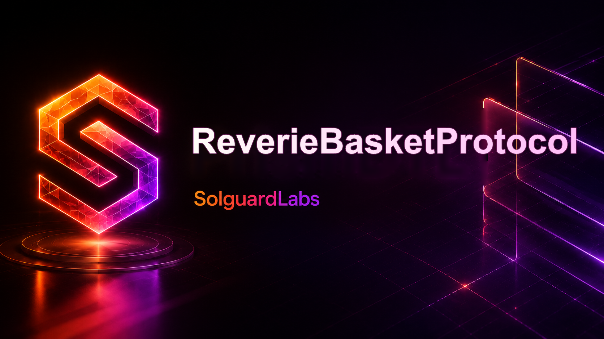

# Reverie Basket Protocol



ReverieBasketProtocol is a Solidity and TypeScript implementation of a tokenized basket protocol.
Users mint `RVB` by depositing a weighted set of ERC-20 components, receive yield-bearing basket
shares, redeem shares in kind, and rely on keepers to schedule weight updates and component
substitutions.

The repository is structured as a production-style review target. Contracts are modular, the
protocol exposes reporting views, and the TypeScript tests cover minting, redemption, yield
harvesting, weight updates, and replacing a basket component.

## Architecture

```text
                  +---------------------+
                  | ReveriePriceOracle |
                  +----------+----------+
                             |
+----------------+   +-------v--------+   +----------------+
| Component      |<--| ReverieBasket  |-->| ReverieLens    |
| Registry       |   | Protocol       |   | Account Lens   |
+----------------+   +-------+--------+   +----------------+
                             |
                             v
                    Reverie Basket Token
```

- `ReverieBasketProtocol` coordinates mint, redeem, harvest, weight updates, and substitutions.
- `ReverieBasketToken` is the ERC-20 receipt minted by the vault.
- `ComponentRegistry` stores component status, weights, yield flags, and operational limits.
- `ReveriePriceOracle` stores admin-managed prices with heartbeat validation.
- `ReverieRiskPolicy` centralizes delay, drift, fee, and substitution limits.
- `ReverieLens` and `ReverieAccountLens` expose monitor-friendly protocol views.

## Requirements

- Node.js 20 or newer.
- npm.

PowerShell users may need to invoke `npm.cmd` if local script execution is disabled.

## Quick Start

```bash
npm install
npm test
```

Windows:

```powershell
npm.cmd install
npm.cmd test
```

Run the CI wrapper:

```bash
bash scripts/ci.sh
```

## Protocol Flow

1. Governance lists basket components and assigns active target weights.
2. Users approve each component and call `mint(basketAmount, receiver)`.
3. The vault pulls the weighted component amounts and mints `RVB`.
4. Keepers call `harvest(asset, amount, source, reportHash)` for realized yield.
5. Rebalancers announce target weight updates, wait for the configured delay, and apply them.
6. Rebalancers can announce a component substitution, receive replacement inventory, then complete
   the replacement after the settlement delay.
7. Users can redeem shares pro rata or request selected in-kind components through the basket
   redemption lane.

## Commands

```bash
npm run build
npm test
npm run clean
```

## Security Model

Roles are separated into governor, keeper, rebalancer, strategist, risk manager, guardian, and
pauser. Production deployments should assign each role to distinct multisig or timelock-controlled
operators. The contracts assume standard ERC-20 behavior and do not support rebasing or
fee-on-transfer components.

## License

Contracts are released under the MIT license.
